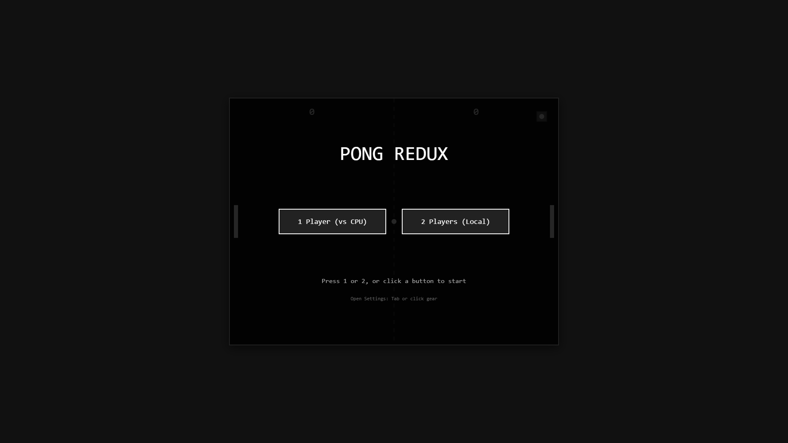

# Pong Redux

**A modern rebuild of Pong with clean architecture, precise physics, and a path to online multiplayer**

[](https://github.com/footnote42/pong-redux/actions)

---

## The Spirit of This Project

This isn't just another Pong clone. It's a **learning exercise** in rebuilding a classic game with modern software engineering principles, testing a "Vibe Coding Workflow" that balances AI-assisted development with deep technical understanding.

### Why Rebuild Pong?

1. **Architecture Matters** - The original game loop had variable timestep issues and scattered state. This rebuild implements a **fixed-timestep game loop** and **centralized state management** from day one.

2. **Future-Proof Design** - Every architectural decision (ES6 modules, state serialization, input buffering) is made with **online multiplayer** in mind, even though that's not yet implemented.

3. **Learning Through Constraints** - By choosing vanilla JavaScript with no frameworks, every decision is explicit and every pattern is learned, not abstracted away.

4. **Quality Over Speed** - 4-6 hour estimated time budget (TRD.md), but willing to go deeper to get the physics right. Stage 2 alone included building a full collision test harness.

---

## 🎮 Try It Now

**[▶️ Play Live Demo](https://footnote42.github.io/pong-redux/)** | **[📖 View Source](https://github.com/footnote42/pong-redux)**

No installation required - runs directly in your browser!

---

## 📸 Screenshots

<div align="center">

### Landing Screen & Mode Selection


### Gameplay in Action


### Settings & Customization


### Paddle Customization (4 Styles + Colors)


### Ball Customization (Styles, Trails, Effects)


### Victory Screen


</div>

---

## What's Been Built (So Far)

### ✅ Stage 1: Core Rendering & Game Loop
- **Fixed-timestep game loop** using `requestAnimationFrame` with accumulator pattern (60Hz updates)
- Spiral of death protection (caps delta time on tab regain focus)
- Paddle factory functions with proper positioning
- Ball physics and rendering
- Clean ES6 module architecture

### ✅ Stage 2: Collision & Physics System
- **AABB (circle-rectangle) collision detection** with positional correction
- **Swept collision guard** to prevent high-speed tunneling
- **Paddle hit angle variation**:
  - Max deflection: **50°** (configurable, tuned for balance)
  - Center deadzone: **5%** (forgiving center hits)
  - Direction-aware reflection (preserves ball speed)
- **Corner-case handling**: simultaneous paddle+wall collisions, spawn-inside-paddle protection
- **Comprehensive test suite**:
  - Headless unit tests (`npm test` runs in Node.js)
  - Browser test suite with visual feedback
  - Interactive debug harness with live tuning sliders
  - GitHub Actions CI pipeline

**Key Achievement**: All collision tests pass. Physics feel tight and predictable.

### ✅ Stages 3-12 Complete
- ✅ Scoring & win conditions
- ✅ Pause system & input handling
- ✅ Landing screen & mode selection
- ✅ CPU opponent with 3 difficulty levels
- ✅ Settings menu with gameplay/audio tabs
- ✅ Paddle customization (4 styles, color picker)
- ✅ Ball customization (4 styles, trail & flash effects)
- ✅ Difficulty tweaks (speed presets, paddle size, endless mode)
- ✅ Sound effects system (Web Audio API, procedural synthesis)

### ✅ Stage 13: Visual Polish & Animations (Complete!)
- Screen transitions with smooth fade effects
- Button press animations (scale feedback)
- Score counter animations (lerp-based)
- Enhanced pause overlay with pulsing text
- Particle effects on collisions (wall & paddle hits)

### 🎯 Portfolio-Ready Features

#### 🎮 **Core Gameplay**
- ✨ Fixed-timestep game loop (60Hz, frame-rate independent)
- 🎯 Precise AABB collision detection with positional correction
- 🎾 Dynamic ball reflection (angle varies by paddle hit position)
- ⏸️ Pause system with smooth overlay animations
- 🏆 Configurable win conditions (5, 7, 11, 15, 21 points + endless mode)

#### 🤖 **Game Modes**
- 👤 **Single Player**: Face off against CPU opponents
  - 🟢 Easy - Beatable for casual play
  - 🟡 Medium - Challenging but fair
  - 🔴 Hard - Lightning-fast reactions
- 👥 **2-Player Local**: Classic couch multiplayer
  - Player 1: W/S keys
  - Player 2: Arrow keys

#### 🎨 **Customization System**
- 🎨 **Paddle Styles**: Classic, Retro, Neon, Custom
  - 10 preset colors + custom color picker
  - Real-time style preview
- ⚡ **Ball Styles**: Classic, Retro, Glow, Soccer
  - Trail effect with configurable length
  - Collision flash effect
  - Dynamic particles on impact
- 🎚️ **Gameplay Tuning**:
  - Ball speed presets (Slow/Normal/Fast/Insane) + slider (0.5x-2.0x)
  - Paddle size adjustment (0.5x-1.5x)
  - Endless mode toggle

#### 🔊 **Sound System**
- 🎵 Procedural Web Audio API synthesis (no external assets)
- 5 distinct effects: Paddle hit, wall bounce, score, victory, UI click
- Volume control + mute toggle
- Smooth fade in/out

#### ⚙️ **Polish & UX**
- 💾 Settings persistence via localStorage
- 🎬 Smooth state transitions with fade effects
- ✨ Button press animations and visual feedback
- 📊 Animated score counters
- 🎆 Particle effects system
- 🎯 Responsive controls with zero input lag

See [build-plan.md](build-plan.md) for the complete roadmap (13 of 16 stages complete, 81%).

---

## Architecture Principles

### 1. Fixed-Timestep Game Loop
**Why it matters**: Prevents frame-rate dependent physics bugs. Critical for future network synchronization.

```javascript
// main.js:8-44
const TIMESTEP = 1000 / 60; // 16.67ms per update
let accumulator = 0;

function gameLoop(currentTime) {
  let deltaTime = currentTime - lastTime;
  deltaTime = Math.min(deltaTime, 250); // Spiral of death protection
  accumulator += deltaTime;

  while (accumulator >= TIMESTEP) {
    updateGame(TIMESTEP); // Fixed 60Hz physics
    accumulator -= TIMESTEP;
  }

  render();
  requestAnimationFrame(gameLoop);
}
```

### 2. Centralized Game State
**Why it matters**: Single source of truth. State is serializable for debugging and future networking.

All game entities (paddles, ball, scores) live in one object (`game-state.js`). No scattered globals.

### 3. Separation of Concerns
**Module structure**:
- `main.js` - Entry point, game loop orchestration
- `game-state.js` - State management, update logic
- `paddle.js` - Paddle entity and movement
- `ball.js` - Ball physics, serving, bounce angle computation
- `collision.js` - AABB detection and positional correction
- `renderer.js` - Canvas drawing (separate from logic)
- `input.js` - Keyboard event buffering

**Rule**: No object allocation inside the game loop. Reuse objects to prevent GC spikes.

### 4. Test-Driven Physics
**Philosophy**: Collision bugs are expensive. Build test infrastructure early.

The collision system has:
- **7 headless unit tests** covering normal hits, edge cases, tunneling prevention
- **Browser test suite** with visual pass/fail indicators
- **Interactive debug harness** with configurable parameters (max bounce angle, center deadzone, swept guard toggles)

This lets us refactor physics confidently without breaking gameplay feel.

---

## Running the Game

### Play the Game
No build system required. Serve the project locally:

```bash
# Option 1: http-server (recommended)
npx http-server .

# Option 2: serve
npx serve .

# Option 3: VS Code Live Server
# Install "Live Server" extension, then right-click index.html → "Open with Live Server"
```

Then open `http://localhost:8080` (or whatever port is shown) and visit `index.html`.

**Controls**:
- **Player 1**: W (up), S (down)
- **Player 2**: Arrow Up, Arrow Down
- **Pause**: P or ESC

### Run Tests

```bash
# Headless collision tests (Node.js)
npm test
# or directly:
node test/run_collision_tests.mjs

# Browser tests (visual feedback)
# Serve the project, then open:
# - test/collision.unit.html (automated suite)
# - test/collision-debug.html (interactive debug harness)
```

**Debug Harness Features**:
- Toggle positional correction on/off
- Toggle swept collision guard
- Adjust max bounce angle (0-90°)
- Adjust center deadzone (0-50%)
- Live visual feedback of collision geometry

---

## Technical Highlights

### Ball Reflection Algorithm
Bounce angle varies based on where the ball hits the paddle:

```javascript
// ball.js:52-60
function computeBounceAngle(ballY, paddleY, paddleHeight, direction) {
  const offset = ballY - paddleY;
  const normalized = offset / (paddleHeight / 2); // -1 to 1

  // Apply center deadzone (5% = ±0.05)
  const adjustedNorm = Math.abs(normalized) < 0.05 ? 0 : normalized;

  const maxDeflection = 50 * (Math.PI / 180); // 50 degrees in radians
  const angle = adjustedNorm * maxDeflection;

  return { x: Math.cos(angle) * direction, y: Math.sin(angle) };
}
```

**Design choice**: Center deadzone makes the game more forgiving. Without it, perfectly centered hits can feel unpredictable.

### Collision Detection with Positional Correction

```javascript
// collision.js:8-32
export function detectBallPaddleCollision(ball, paddle) {
  // Find closest point on rectangle to circle center
  const closestX = Math.max(paddle.x - paddle.w/2,
                            Math.min(ball.x, paddle.x + paddle.w/2));
  const closestY = Math.max(paddle.y - paddle.h/2,
                            Math.min(ball.y, paddle.y + paddle.h/2));

  const dx = ball.x - closestX;
  const dy = ball.y - closestY;
  const distSq = dx*dx + dy*dy;

  if (distSq < ball.radius * ball.radius) {
    // Collision! Apply positional correction to prevent sticking
    const dist = Math.sqrt(distSq);
    const overlap = ball.radius - dist;

    if (dist > 0) {
      ball.x += (dx / dist) * overlap; // Push ball out
    }
    return true;
  }
  return false;
}
```

**Why positional correction matters**: Without it, the ball "sticks" to the paddle for multiple frames. By explicitly moving the ball out of penetration, we ensure clean bounces.

### Swept Collision Guard (Tunneling Prevention)

```javascript
// game-state.js:42-44
const maxDist = Math.abs(ball.vx * deltaTime / 1000);
if (Math.abs(ball.x - leftPaddle.x) < leftPaddle.w / 2 + ball.radius + maxDist) {
  // Only check collision if ball is near paddle (prevents tunneling)
}
```

**Problem**: At high speeds, the ball can move more than its diameter in one frame, passing through the paddle between updates.

**Solution**: Guard collision checks with distance-based proximity test. If the ball could potentially overlap in this frame, check collision. Otherwise skip.

---

## Design Decisions & Tradeoffs

### Why Vanilla JS Instead of a Framework?
- **Learning goal**: Understand every line, don't abstract away game loop patterns
- **Simplicity**: No build step, no dependency management, no framework churn
- **Future flexibility**: Easy to add Socket.io for multiplayer without refactoring core logic
- **Performance**: Zero framework overhead, direct Canvas API calls

### Why AABB (Circle-Rectangle) Over Circle-Circle?
- **Paddles are rectangular**: AABB matches the visual representation
- **Simpler math**: Closest-point algorithm is more intuitive than dual-circle intersections
- **Good enough**: The game feels fair and responsive

### Why Fixed Timestep?
- **Determinism**: Physics behave identically at 30fps, 60fps, or 144fps
- **Future-proof**: Required for client-side prediction and server reconciliation in online play
- **Industry standard**: Every serious game engine uses fixed timestep for physics

**Tradeoff**: Slightly more complex loop logic (accumulator pattern) vs. naive `deltaTime` scaling.

---

## Project Structure

```
pong-redux/
├── index.html              # Entry point
├── styles.css              # Minimal styling
├── src/
│   ├── main.js             # Game loop (fixed timestep, 60Hz)
│   ├── game-state.js       # Centralized state & update logic
│   ├── paddle.js           # Paddle entity factory
│   ├── ball.js             # Ball physics & serving
│   ├── collision.js        # AABB collision + correction
│   ├── renderer.js         # Canvas drawing
│   └── input.js            # Keyboard event buffering
├── test/
│   ├── run_collision_tests.mjs  # Headless Node.js tests
│   ├── collision.unit.html      # Browser test suite
│   └── collision-debug.html     # Interactive debug harness
├── .github/
│   └── workflows/ci.yml         # GitHub Actions (runs tests on push)
├── README.md               # You are here
├── build-plan.md           # 16-stage roadmap (Stages 1-2 complete)
├── TRD.md                  # Technical Requirements Document
└── CLAUDE.md               # Project instructions for Claude Code
```

**Key files for understanding the codebase**:
1. **[CLAUDE.md](CLAUDE.md)** - Architectural overview, implementation patterns, debugging tips
2. **[TRD.md](TRD.md)** - Requirements (MoSCoW prioritization), acceptance criteria, learning checkpoints
3. **[build-plan.md](build-plan.md)** - Granular execution plan with time estimates and AI tool strategy

---

## Learning Outcomes (So Far)

### Technical
- **Fixed-timestep game loops**: Understood accumulator pattern and spiral of death protection
- **Collision geometry**: Implemented AABB detection with swept collision guards
- **Test-driven gamedev**: Built test harness before finalizing physics tuning
- **Module boundaries**: Kept rendering, physics, and input cleanly separated

### Workflow
- **"Vibe Coding"**: Used Claude for architecture decisions, Copilot for implementation, manual tuning for game feel
- **Test infrastructure ROI**: Debug harness paid for itself immediately—caught 3 edge cases in first session
- **Documentation discipline**: Writing CLAUDE.md and TRD.md upfront made AI collaboration more effective

### Game Design
- **Center deadzone matters**: 5% deadzone made the game feel fair vs. frustrating
- **Max bounce tuning**: 50° feels balanced between control and excitement (vs. 60° which felt chaotic)
- **Swept collision**: Essential at any ball speed above 400px/s

---

## What Makes This Different from Other Pong Clones

1. **Architecture for scale**: Built from day one with online multiplayer in mind (state serialization, fixed timestep, input buffering) - even though multiplayer isn't implemented, the foundation is ready.

2. **Test-first physics**: Most Pong clones tweak collision until it "feels right." This project has automated tests, visual debug harness, and comprehensive edge-case handling.

3. **Documented learning journey**: [build-plan.md](build-plan.md), [TRD.md](TRD.md), and [CHANGELOG.md](CHANGELOG.md) capture the complete thought process, not just the final code.

4. **No shortcuts on fundamentals**: Implemented proper fixed-timestep loop, positional correction, swept collision detection, and animation system—patterns you'd find in commercial game engines.

5. **Production-ready polish**: Extensive customization (paddles, balls, difficulty), procedural sound system, smooth animations, particle effects, and comprehensive testing - all with solid 60fps performance.

---

## Project Status & Roadmap

**🎉 v1.0.0 Released - Portfolio Ready!**

See [build-plan.md](build-plan.md) for detailed breakdown. High-level progress:

**Phase 1: Core Mechanics** (Stages 1-4) - **✅ COMPLETE**
- ✅ Rendering & game loop (fixed-timestep, 60Hz)
- ✅ Collision & physics (AABB with positional correction)
- ✅ Scoring & win conditions (configurable)
- ✅ Pause & input polish

**Phase 2: Game Modes** (Stages 5-7) - **✅ COMPLETE**
- ✅ Landing screen & mode selection
- ✅ AI opponent (1-player mode with 3 difficulties)
- ✅ Instructions & help system (first-time overlay)

**Phase 3: Customization** (Stages 8-11) - **✅ COMPLETE**
- ✅ Settings menu foundation (tabbed interface)
- ✅ Paddle styles & colors (4 styles + custom colors)
- ✅ Ball effects & trails (4 styles + configurable effects)
- ✅ Difficulty tuning sliders (speed, size, endless mode)

**Phase 4: Polish** (Stages 12-16) - **✅ COMPLETE**
- ✅ Sound effects (Web Audio API - 5 procedural effects)
- ✅ Visual polish & animations (transitions, particles, lerping)
- ⏭️ Stats tracking (postponed - not required for v1.0.0)
- ✅ Final testing & deployment (comprehensive testing, GitHub Pages)
- ✅ Documentation & portfolio prep (screenshots, blurbs, v1.0.0 release)

**📊 Completion:** 13 of 16 stages (81%) - **Portfolio Ready**

**Future Enhancements** (optional, post-v1.0.0):
- Stats tracking & scoreboard (Stage 14)
- Online multiplayer (architecture already supports it)
- Mobile touch controls
- Leaderboards & cloud sync
- Additional customization options

---

## Contributing & Feedback

This is a **personal learning project**, but feedback on architecture decisions, physics tuning, or test coverage is welcome!

**Interesting areas for discussion**:
- Is the center deadzone too large/small? (Currently 5%)
- Should max bounce angle be user-configurable in settings? (Currently hardcoded 50°)
- Better ways to structure game state for future networking?
- Test coverage gaps in the collision system?

Open an issue or PR if you spot bugs, physics edge cases, or have suggestions for the AI implementation (Stage 6).

---

## License

MIT License - Feel free to learn from, fork, or build upon this code.

**Attribution appreciated but not required.** If you use the collision detection algorithm or test harness setup in your own projects, a link back would be cool!

---

## Acknowledgments

- **Original Pong** (Atari, 1972) - Still the best example of "simple to learn, hard to master"
- **Game Programming Patterns** (Robert Nystrom) - Fixed timestep pattern reference
- **MDN Web Docs** - Canvas API and Web Audio documentation
- **Claude & GitHub Copilot** - AI pair programming tools used throughout development
- **Wayne's Prior Pong Clone** - The "v1" this project improves upon

---

**Current Status**: Stage 13 complete (Visual Polish & Animations) ✅
**Progress**: 13 of 16 stages complete (81%) - Portfolio Ready!
**Next Up**: Deployment & final documentation
**Last Updated**: 2025-12-22
